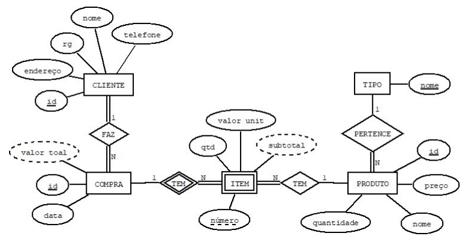

# 💐 API Floricultura 

Projeto desenvolvido como parte da disciplina de Frameworks Full Stack do curso de Sistemas de Informação.

Está é uma API RESTfull para gerenciamento de uma floricultura, implementada em Python com framework Flask, utilizando o SQLAlchemy para persistência e documentação com Swagger.

## 👩‍💻 Desenvolvedoras
[Emily Rafaela](https://github.com/Emilyrts)

[Laura Dias](https://github.com/L-diaaas)

[Talita Yuki](https://github.com/taltsolyu)

## 🗃️ Estrutura do Projeto

```
API-Floricultura/
├── clientes/
│   ├── cliente_model.py
│   └── cliente_rotas.py
├── compras/
│   ├── compras_model.py
│   └── compras_routes.py
├── img/
│   └── diagramaFloricultura.png # Diagrama Entidade-Relacionamento
├── instance/
│   └── app.db  # Banco de dados SQLite
├── itens/
│   ├── item_model.py
│   └── item_routes.py
├── produtos/
│   ├── produto_model.py
│   └── produto_routes.py
├── swagger/    
│   ├── namespace/
│       ├── clientes_namespace.py
│       ├── compras_namespace.py
│       ├── itens_namespace.py
│       ├── produtos_namespace.py
│       └── tipos_namespace.py
│   ├── __init__.py
│   └── swagger_config.py
├── tipos/
│   ├── tipo_model.py
│   └── tipo_route.py
├── .gitignore  # Arquivo que Git deve ignorar
├── app.py      # Arquivo principal
├── config.py   # Configurações da aplicação
├── dockerfile  # Dockerfile para containerização
├── README.md
└── requirements.txt    # Dependências do projeto
```

## 🚀 Como Executar

- Python 3.10+

- (Opicioanl) Docker

- Pipenv ou virtualenv (opcional, mas recomendado)

### Passos para rodar localmente

- Clone o repositório


        git clone https://github.com/Emilyrts/API-Floricultura.git

        cd API-Floricultura

- Crie o ambiente virtual

        python -m venv venv

        source venv/bin/activate    #Linux/Mac

        venv\Scripts\activate       #Windows

- Instale as dependências

       pip install -r requirements.txt

- Execute a aplicação

        python app.py

## ⌨️ Endpoints principais

- A aplicação estará disponível em:

        http://localhost:5000

- #### Clientes: 
  Se refere aos clientes da floricultura.

                http://localhost:5000/clientes


    - `GET /clientes` – Listar todos
    - `POST /clientes` – Criar novo
    - `GET /clientes/<id>` – Buscar por ID
    - `PUT /clientes/<id>` – Atualizar
    - `DELETE /clientes/<id>` – Remover

- #### Compras: 
  Representa os registros das compras realizadas pelos clientes da floricultura. Cada compra está associada a um ou mais itens e a um cliente específico.

                http://localhost:5000/compras

    - `GET /compras` – Listar todos
    - `POST /compras` – Criar novo
    - `GET /compras/<id>` – Buscar por ID
    - `PUT /compras/<id>` – Atualizar
    - `DELETE /compras/<id>` – Remover

- #### Itens: 
  Refere-se aos itens individuais que compõem uma compra, contendo informações como quantidade, valor e o produto vinculado.

                http://localhost:5000/itens

    - `GET /itens` – Listar todos
    - `POST /itens` – Criar novo
    - `GET /itens/<id>` – Buscar por ID
    - `PUT /itens/<id>` – Atualizar
    - `DELETE /itens/<id>` – Remover

-  #### Produtos:
   Representa os produtos disponíveis para venda na floricultura, como flores, vasos, arranjos e outros artigos relacionados.

                http://localhost:5000/produtos

    - `GET /produtos` – Listar todos
    - `POST /produtos` – Criar novo
    - `GET /produtos/<id>` – Buscar por ID
    - `PUT /produtos/<id>` – Atualizar
    - `DELETE /produtos/<id>` – Remover

- #### Tipos: 
  Define as categorias ou classificações dos produtos da floricultura (por exemplo: flores naturais, flores artificiais, vasos decorativos).

                http://localhost:5000/tipos

    - `GET /tipos` – Listar todos
    - `POST /tipos` – Criar novo
    - `GET /tipos/<id>` – Buscar por ID
    - `PUT /tipos/<id>` – Atualizar
    - `DELETE /tipos/<id>` – Remover

#### ⚠️ Atenção: a ordem de cadastro importa.
Devido aos relacionamentos entre as entidades, a API exige uma ordem específoca ao cadastrar:

- Deve existir **ao menos um Cliente** cadastrado para que seja possível registrar uma **Compra**.
- Deve existir **ao menos um Tipo de Produto** cadastrado para que seja possível cadastrar um **Produto**.
- Deve existir **ao menos um Produto e uma Compra** cadastrados para que seja possível registrar um **Item**.

## 🛠️ Funcionalidades

- ✅ CRUD completo (criação, listagem, atualização e remoção) de clientes, compras, itens, produtos e tipos de produtos
- ✅ Documentação interativa via Swagger UI
- ✅ Padrão MVC (Model-View-Controller) com rotas separadas por entidade
- ✅ Banco de dados SQLite para persistência local

## 🧭 Documentação Swagger

A documentação interativa da API pode ser acessada em:

                http://localhost:5000/api/docs

## 🐋 Docker (Opicioanl)
Para rodar com Docker:

- Crie a imagem

                docker build -t apifloricultura .

- Execute o container

                docker run -p 5000:5000 apifloricultura

## 📌 Observações
- Projeto desenvolvido para fins acadêmicos na disciplina de Frameworks Full Stack.

- O banco de dados utilizado é o SQLite (instance/app.db).

- A estrutura segue o padrão MVC com rotas separadas por entidade.     

## 📈 Diagrama de Entidade-Relacionamento



